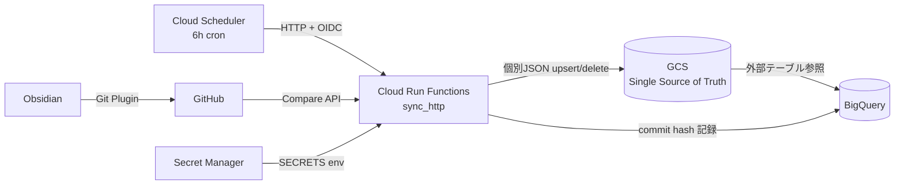
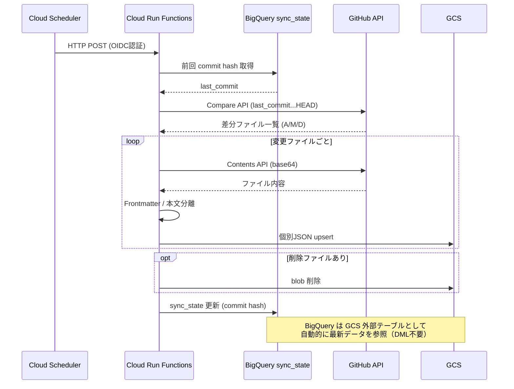

# obsidian-github-gcs-export

Obsidian Vault の Markdown ファイルを GitHub → GCS → BigQuery(外部テーブル) へ差分同期するパイプライン。

## アーキテクチャ





- **GCS** がデータの Single Source of Truth
- **BigQuery** は GCS を外部テーブルとして参照（DML なし・コストゼロ）
- **差分同期**: コミットハッシュで変更検知し、変更ファイルのみ処理

## プロジェクト構成

```
├── src/
│   ├── main.py                # Cloud Run Functions エントリポイント
│   ├── local_upload.py        # ローカル Vault → GCS 初回一括アップロード
│   ├── sync/
│   │   ├── git_diff.py        # GitHub API 差分取得
│   │   ├── markdown_parser.py # Frontmatter / 本文分離
│   │   ├── bigquery_sync.py   # sync_state 管理 + 外部テーブル定義
│   │   └── gcs_exporter.py    # GCS 差分書き込み
│   └── utils/
│       └── stored_gcs.py      # GCS キャッシュユーティリティ
├── deploy.sh                  # Cloud Run Functions デプロイ + Scheduler 設定
├── local_upload.sh            # ローカルアップロード実行スクリプト
├── setup_iam.sh               # サービスアカウント IAM 権限付与
├── Dockerfile                 # コンテナビルド定義
├── pyproject.toml             # uv 依存管理
├── .env.sample                # デプロイ設定テンプレート
└── secrets.json.sample        # ランタイムシークレットテンプレート
```

## セットアップ

### 前提条件

- Python 3.12+
- [uv](https://docs.astral.sh/uv/)
- GCP プロジェクト (BigQuery, GCS, Cloud Run Functions, Secret Manager)
- Obsidian Vault を管理する GitHub リポジトリ

### 設定ファイル

#### `.env` — デプロイ設定（`deploy.sh`, `setup_iam.sh` が参照）

| 変数 | 説明 | 例 |
|------|------|------|
| `FUNCTION_NAME` | Cloud Run Functions 名 | `obsidian-sync` |
| `SERVICE_ACCOUNT` | サービスアカウント | `sa@project.iam.gserviceaccount.com` |
| `SECRETS_MANAGER` | Secret Manager パス | `projects/123/secrets/obsidian-sync/versions/latest` |
| `GCP_PROJECT` | GCP プロジェクト ID | `my-project-123` |

#### `secrets.json` — ランタイムシークレット（Secret Manager + ローカル実行で使用）

| 変数 | 説明 | 例 |
|------|------|------|
| `GITHUB_TOKEN` | GitHub Personal Access Token | `ghp_xxx` |
| `GITHUB_REPO` | Vault の GitHub リポジトリ | `user/vault-repo` |
| `GCS_BUCKET` | GCS バケット名 | `my-bucket` |
| `GCS_BLOB_PREFIX` | GCS 内のプレフィックス | `obsidian/` |
| `GCP_PROJECT` | GCP プロジェクト ID（ローカル実行時） | `my-project-123` |

### 1. 依存インストール

```bash
uv sync
```

### 2. GCP リソース作成

```bash
# GCS バケット (既存の場合はスキップ)
gcloud storage buckets create gs://${GCS_BUCKET} --location=asia-northeast1

# BigQuery データセット + テーブル
# 外部テーブルと sync_state は初回実行時に自動作成される
# 手動作成する場合は docs/setup_bigquery.sql を参照
```

### 3. IAM 権限付与

サービスアカウントに必要な権限を一括付与する。

```bash
bash setup_iam.sh
```

付与されるロール:

| ロール | 用途 |
|--------|------|
| `roles/bigquery.dataEditor` | sync_state 読み書き・外部テーブル作成 |
| `roles/bigquery.jobUser` | BigQuery クエリ実行 |
| `roles/storage.objectUser` | GCS ドキュメント読み書き |
| `roles/secretmanager.secretAccessor` | Secret Manager からの読み取り |

### 4. 設定ファイル作成

```bash
cp .env.sample .env
cp secrets.json.sample secrets.json
# それぞれ値を編集
```

### 5. デプロイ

`deploy.sh` が以下を一括実行する:
- `requirements.txt` 生成（`uv pip compile`）
- `secrets.json` の Secret Manager 差分更新（新規作成含む）
- Cloud Run Functions デプロイ（HTTP トリガー）
- Cloud Scheduler ジョブの作成/更新（6時間ごと）

```bash
bash deploy.sh
```

## データモデル

### GCS: `gs://${GCS_BUCKET}/obsidian/{file_path}.json`

```json
{
  "file_path": "blog/published/example.md",
  "dir_path": "blog/published",
  "file_name": "example",
  "category": "blog",
  "title": "Example Note",
  "tags": ["tag1", "tag2"],
  "content": "本文テキスト...",
  "frontmatter": "{\"key\": \"value\"}"
}
```

### BigQuery: `obsidian_vault.documents` (外部テーブル)

GCS の JSON ファイルを直接参照。スキャン時のみ課金。

```sql
-- 全文検索
SELECT file_path, title, SUBSTR(content, 1, 200) AS preview
FROM `obsidian_vault.documents`
WHERE SEARCH(content, 'キーワード')

-- タグでフィルタ
SELECT file_path, title
FROM `obsidian_vault.documents`
WHERE 'blog' IN UNNEST(tags)

-- タイトル部分一致
SELECT file_path, title
FROM `obsidian_vault.documents`
WHERE title LIKE '%検索語%'

-- ドキュメント総数
SELECT COUNT(*) AS total FROM `obsidian_vault.documents`

-- カテゴリ別ドキュメント数
SELECT category, COUNT(*) AS cnt
FROM `obsidian_vault.documents`
GROUP BY category ORDER BY cnt DESC

-- ディレクトリでフィルタ
SELECT file_name, title
FROM `obsidian_vault.documents`
WHERE dir_path = 'blog/published'

-- タグ別集計
SELECT tag, COUNT(*) AS cnt
FROM `obsidian_vault.documents`, UNNEST(tags) AS tag
GROUP BY tag ORDER BY cnt DESC

-- Frontmatter の JSON フィールドを参照
SELECT file_path, title,
  JSON_VALUE(frontmatter, '$.key') AS key
FROM `obsidian_vault.documents`
WHERE JSON_VALUE(frontmatter, '$.key') IS NOT NULL

-- 同期状態の確認
SELECT * FROM `obsidian_vault.sync_state` WHERE id = 'latest'
```

#### BigQuery ML (Gemini) による全文検索 + 要約

```bash
# 初回のみ: Cloud リソース接続を作成し、Vertex AI User ロールを付与
bq mk --connection --location=US --connection_type=CLOUD_RESOURCE gemini_conn
```

```sql
-- 初回のみ: リモートモデル作成 (Gemini 3 は global エンドポイントを指定)
CREATE OR REPLACE MODEL `obsidian_vault.gemini`
REMOTE WITH CONNECTION `us.gemini_conn`
OPTIONS (endpoint = 'https://aiplatform.googleapis.com/v1/projects/YOUR_PROJECT_ID/locations/global/publishers/google/models/gemini-3-flash-preview');

-- 全文検索 → Gemini で要約
WITH search_results AS (
  SELECT file_path, title, content
  FROM `obsidian_vault.documents`
  WHERE SEARCH(content, 'キーワード')
),
prompts AS (
  SELECT file_path, title,
    CONCAT('以下のドキュメントを日本語で100文字以内に要約してください:\n\n', content) AS prompt
  FROM search_results
)
SELECT file_path, title, result AS summary
FROM AI.GENERATE_TEXT(
  MODEL `obsidian_vault.gemini`,
  TABLE prompts,
  STRUCT(256 AS max_output_tokens, 0.2 AS temperature)
);
```

### BigQuery: `obsidian_vault.sync_state` (ネイティブテーブル)

| カラム | 型 | 説明 |
|--------|------|------|
| id | STRING | 固定値 `latest` |
| commit_hash | STRING | 前回成功コミットハッシュ |
| synced_at | TIMESTAMP | 同期日時 |
| files_added | INT64 | 追加ファイル数 |
| files_modified | INT64 | 変更ファイル数 |
| files_deleted | INT64 | 削除ファイル数 |

## 運用

### 定期実行

Cloud Scheduler により6時間ごと（JST 0:00, 6:00, 12:00, 18:00）に自動実行。

### 手動実行

```bash
gcloud functions call obsidian-sync --region=asia-northeast1 --gen2
```

### 初回同期（ローカルアップロード）

GitHub にまだ Vault が push されていない場合や、初回データ投入時はローカルから直接アップロードできる。

```bash
# 1. secrets.json を設定
cp secrets.json.sample secrets.json
# GCS_BUCKET, GCS_BLOB_PREFIX, GCP_PROJECT, GITHUB_TOKEN, GITHUB_REPO を記入

# 2. GCP 認証
gcloud auth application-default login

# 3. ドライラン（対象ファイル確認）
bash local_upload.sh ~/Obsidian --dry-run

# 4. 実行
bash local_upload.sh ~/Obsidian
```

アップロード完了後、GitHub リポジトリの最新コミットハッシュが `sync_state` に記録される。
以降は Cloud Scheduler による差分同期に自動で切り替わる。

### 初回同期（GitHub 経由）

`sync_state` が空の状態で Cloud Run Functions が実行されると、リポジトリ内の全 `.md` ファイルを対象にフルスキャンを実行する。
